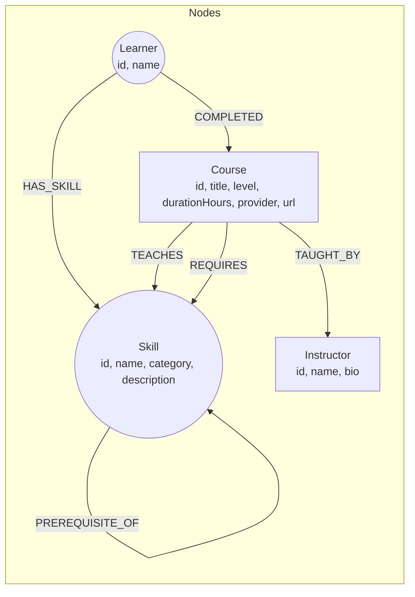

# SkillPath

A knowledge graph of skills and courses. SkillPath answers the questions a
learning platform actually gets asked — _"what's the fastest way from what I
know to what I want to learn?"_, _"which skill, if I learned it, would open
the most doors?"_, _"what should I take next, given what people like me have
already taken?"_ — by walking a graph instead of joining tables.

Built for the Wexa AI take-home assignment, backed by **CognoDB** (a managed,
Bolt-compatible graph database) via the official Neo4j JavaScript driver.

- **Backend**: Node.js / Express, `neo4j-driver`, parameterised Cypher only
- **Frontend**: React (Vite), React Router, no CSS framework
- **Data model**: `Skill`, `Course`, `Instructor`, `Learner` nodes; five
  relationship types

---

## Why a graph database?

The interesting questions in a learning catalog are all about _chains of
connections_, not rows:

- **"What's the shortest path from React to System Design?"** is a
  variable-length traversal. In Postgres this is a recursive CTE with a
  hand-picked max depth and no built-in notion of "shortest" — you write the
  recursion, dedupe visited nodes yourself, and re-derive path length. In
  Cypher it's one line: `shortestPath((from)-[:PREREQUISITE_OF*1..10]->(to))`.
- **"Which skills unlock the most other skills, directly or transitively?"**
  is a transitive-closure query over an arbitrary number of hops. Relationally
  you're stuck with the same recursive-CTE problem, at table-scan cost, for
  every skill. In Cypher it's `[:PREREQUISITE_OF*1..6]` and a `count(DISTINCT)`.
- **"Recommend a course to someone based on what people who know similar
  things have completed"** is a two-hop similarity join (learner → shared
  skills → other learners → their completions) that would otherwise need a
  self-join on a bridge table with a `HAVING count(*) >= 2`, then another
  join back out to courses. As a graph pattern it reads the way you'd
  describe it out loud.

None of this data is _large_ — a few hundred nodes is enough to show the
shape of the problem — but the _shape of the queries_ is what a relational
schema fights and a property graph embraces. That's the case for CognoDB
here: not scale, but the natural fit between "prerequisite chains" and
"graph traversal."

---

## Data model



**29 skills** across 7 categories (Foundations, Web, Data, Systems, AI,
DevOps, Design), wired into a prerequisite DAG — e.g.
`Programming Basics → HTML & CSS → JavaScript → React`, or
`Databases → Graph Databases`. **31 courses**, each teaching 1–2 skills and
requiring 0–2 prerequisite skills. **6 instructors**, **6 learners** with
realistic `HAS_SKILL` / `COMPLETED` histories used by the recommender.

Full seed data: [`server/seed/data.js`](server/seed/data.js).

---

## The four queries, explained

All Cypher lives in one place: [`server/src/queries.js`](server/src/queries.js).

1. **`shortestSkillPath`** — the path finder's core query. Given two skill
   ids, finds the shortest chain of `PREREQUISITE_OF` edges between them and,
   for each step, a couple of courses that teach it. **Multi-hop traversal.**

   ```cypher
   MATCH (from:Skill {id: $fromId}), (to:Skill {id: $toId})
   MATCH p = shortestPath((from)-[:PREREQUISITE_OF*1..10]->(to))
   RETURN [n IN nodes(p) | {
     id: n.id, name: n.name, category: n.category,
     sampleCourses: [(course:Course)-[:TEACHES]->(n) | course.title][0..2]
   }] AS steps, length(p) AS hops
   ```

2. **`gatewaySkills`** — ranks skills by how many _other_ skills they
   transitively unlock, up to 6 hops out. **The relational-awkward one**:
   this is a full transitive closure with distinct counting, which in SQL
   means a recursive CTE re-run per skill or a hand-rolled closure table
   maintained on every write.

   ```cypher
   MATCH (s:Skill)-[:PREREQUISITE_OF*1..6]->(downstream:Skill)
   RETURN s.id AS id, s.name AS name, count(DISTINCT downstream) AS unlockedCount
   ORDER BY unlockedCount DESC LIMIT 10
   ```

3. **`recommendationsForLearner`** — courses a learner is _ready_ for
   (every required skill already known) that also teach something new,
   ranked by how many peers who share 2+ known skills have already completed
   the course. Readiness (graph traversal) and popularity-among-similar-
   people (collaborative filtering) in one query.

4. **`skillDetail`** — direct prerequisites, direct unlocks, and teaching
   courses for a single skill: three one-hop fan-outs from one node,
   returned together.

Every query above runs through the official Neo4j driver with named
parameters (`$fromId`, `$learnerId`, …) — see [`server/src/db.js`](server/src/db.js).
No Cypher is ever built by string concatenation.

---

## Project structure

```
skillpath/
├── server/                  Express API
│   ├── src/
│   │   ├── index.js         App entry, routes, central error handler
│   │   ├── db.js            Driver setup + query helpers (env-configured)
│   │   ├── queries.js       All Cypher, documented
│   │   └── routes/          skills, courses, path, recommend, overview
│   └── seed/
│       ├── data.js          Seed dataset (skills, courses, learners, edges)
│       └── seed.js          Idempotent loader (MERGE, batched via UNWIND)
└── client/                  React (Vite) frontend
    └── src/
        ├── pages/           Explore, SkillDetail, Courses, CourseDetail,
        │                    PathFinder, Recommendations
        ├── components/      Navbar, SkillCard, CourseCard, PathLine, States
        └── lib/api.js       Fetch wrapper for the API
```

---

## Setup

### 1. Create your CognoDB instance

1. Sign up at [console.cognodb.com/signup](https://console.cognodb.com/signup) (free, no card).
2. Create a free **c0** instance and pick a region — provisions in under a minute.
3. Copy the connection URI (`bolt+s://<instance-id>.databases.cognodb.cloud`)
   and the generated password for user `cognodb`. **The password is shown
   once** — save it now.

### 2. Configure and seed the server

```bash
cd server
npm install
cp .env.example .env
# edit .env: paste your COGNODB_URI and COGNODB_PASSWORD
npm run seed     # loads all nodes and relationships (safe to re-run)
npm run dev      # starts the API on http://localhost:4000
```

`npm run seed` creates uniqueness constraints, then loads skills, courses,
instructors, and learners, then wires up every relationship — all through
batched, parameterised `UNWIND` queries so re-running it is a no-op merge,
not a duplicate insert.

### 3. Run the client

```bash
cd client
npm install
npm run dev       # http://localhost:5173, proxies /api to :4000
```

Open `http://localhost:5173`. If the API can't reach CognoDB, every page
shows a clear error state with a retry button rather than crashing — try it
by pointing `.env` at a wrong password.

### 4. Build for production

```bash
cd client && npm run build     # outputs client/dist
cd server && npm start         # serves the API only; host client/dist separately,
                                # or add static-file serving to server/src/index.js
```

If you deploy the client and server to different hosts, set
`VITE_API_URL` in `client/.env` to the deployed API's `/api` base URL before
building.

---

## Deployment

_(Add your hosted demo link here.)_

- **API**: deploy `server/` to any Node host (Render, Fly.io, Railway) with
  `COGNODB_URI` / `COGNODB_PASSWORD` set as environment variables.
- **Client**: deploy `client/` to any static host (Vercel, Netlify, Render
  static site) with `VITE_API_URL` pointing at the deployed API.

---

## Screenshots

_(Add screenshots of Explore, Skill Detail, Path Finder, and Recommendations
here once the app is running against your CognoDB instance.)_

---

## Error handling

- The API's `/api/health` endpoint calls `driver.verifyConnectivity()` and
  reports `degraded` with a clear message if CognoDB is unreachable, instead
  of throwing.
- Every route forwards failures to a single Express error handler that
  distinguishes connection issues (503, actionable message) from unexpected
  errors (500, generic message) — no stack traces reach the client.
- Every page in the client has explicit loading, empty, and error states
  (see `client/src/components/States.jsx`) with a retry action wherever a
  retry makes sense.
